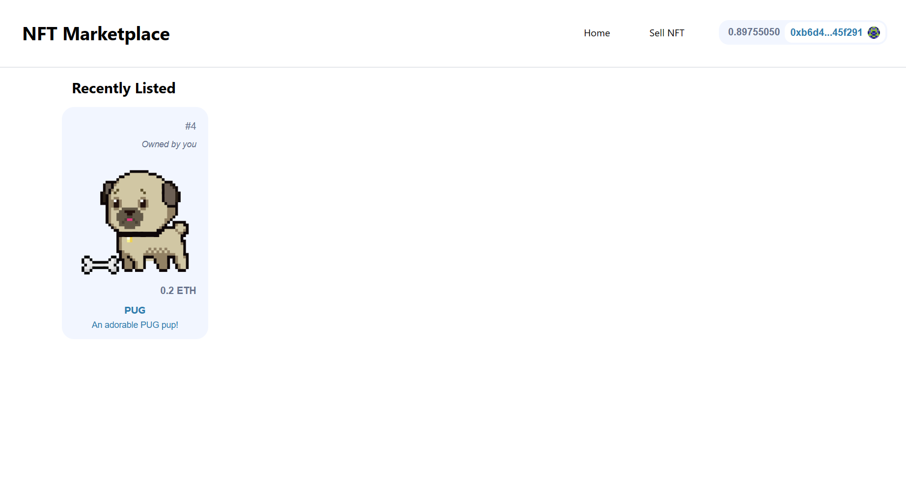
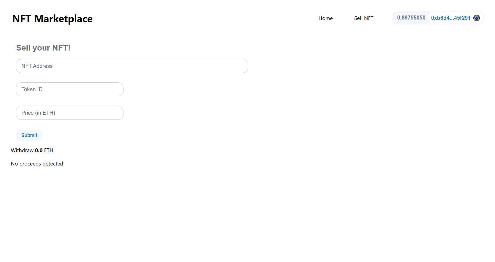

# NextJS NFT Marketplace with TheGraph

<br/>
<p align="center">

</a>
</p>
<p align="center">

</a>
</p>
<br/>

## 1. Git clone the contracts repo

In it's own terminal / command line, run: 

```
git clone https://github.com/veoquynhs/hardhat-nft-marketplace-fcc.git
cd hardhat-nft-marketplace-fcc
yarn
```

## 2. Deploy to Sepolia 

After installing dependencies, deploy your contracts to sepolia:

```
yarn hardhat deploy --network sepolia
```

## 3. Deploy your Subgraph

```
cd ..
git clone https://github.com/veoquynhs/graph-nft-marketplace-fcc.git
cd graph-nft-marketplace-fcc
yarn
```

Follow the instructions of the [README](https://github.com/veoquynhs/graph-nft-marketplace-fcc/blob/main/README.md) of that repo. 

Then, make a `.env` file and place your temporary query URL into it as `NEXT_PUBLIC_SUBGRAPH_URL`.


## 4. Start your UI

Make sure that:
- In your `networkMapping.json` you have an entry for `NftMarketplace` on the Sepolia network. 
- You have a `NEXT_PUBLIC_SUBGRAPH_URL` in your `.env` file. 

```
yarn dev
```

